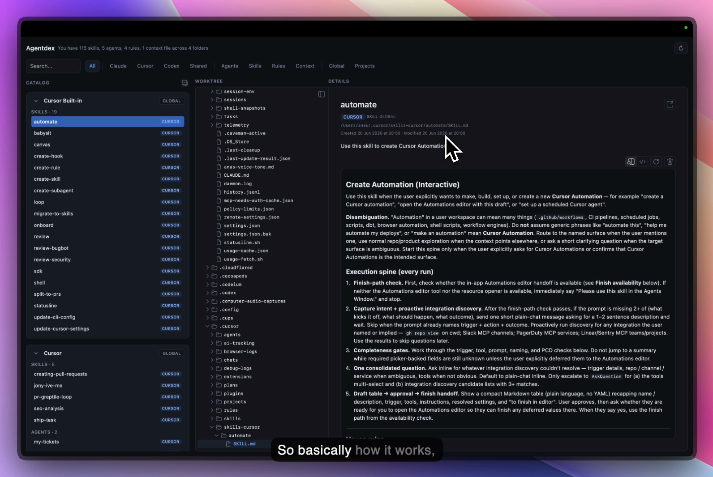

<p align="center"></p>

<h1 align="center">Agentdex</h1>

<p align="center"><strong>Your local command center for AI skills, agents, and rules.</strong></p>

<p align="center">A local desktop app that turns the skills, subagents, rules, and <code>CLAUDE.md</code> files scattered across your Cursor, Claude, and Codex setups into one searchable catalog.</p>

> ### 🔒 Fully local. Fully private.
>
> Agentdex runs **entirely on your machine**. It reads local files under your home directory and does nothing else — **no internet connection required**, **no account**, **no cloud**, **no telemetry**. **No data whatsoever is collected, sent, or stored anywhere off your device.** The only optional network access is checking GitHub Releases for app updates, which you control.



**Supported platforms:** macOS (primary), Windows, Linux (best-effort)

---

## Contents

- [Features](#features)
- [Install](#install)
  - [Download a pre-built app](#download-a-pre-built-app)
  - [Run from source](#run-from-source)
- [What it scans](#what-it-scans)
- [Updates](#updates)
- [Contributing](#contributing)
- [Tech stack](#tech-stack)
- [For maintainers](#for-maintainers)
- [License](#license)

## Features

- **One catalog** — every skill, subagent, rule, and `CLAUDE.md` context file across Cursor, Claude, and Codex, in a single list.
- **Search & filter** — find anything by name or description; filter by kind (skill / agent / rule / context) and platform.
- **Preview & edit** — render markdown, or switch to raw mode and edit in place (saved straight to disk).
- **Reveal & explore** — open any file in your system file manager, or browse the surrounding folder tree in the worktree panel.
- **Offline & private** — no account, no cloud, no telemetry.

## Install

### Download a pre-built app

Grab the build for your platform from the **[download page](https://captainyouz.github.io/agentdex/download.html)** (auto-detects your OS) or directly from [GitHub Releases](https://github.com/CaptainYouz/agentdex/releases/latest).

| OS | Artifacts |
|----|-----------|
| macOS | `.dmg` (Apple Silicon + Intel) |
| Windows | `.msi` / `.exe` (unsigned) |
| Linux | `.AppImage` and `.deb` |

Builds are not yet code-signed/notarized, so each OS warns on first launch:

- **macOS** — “Agentdex is damaged and can't be opened.” After moving the app to Applications, clear the quarantine flag, then open normally:
  ```bash
  xattr -dr com.apple.quarantine /Applications/Agentdex.app
  ```
- **Windows** — SmartScreen may show “Windows protected your PC.” Click **More info → Run anyway**.
- **Linux** — make the AppImage executable (`chmod +x`) and run it, or install the `.deb` with your package manager.

### Run from source

```bash
git clone git@github.com:CaptainYouz/agentdex.git
cd agentdex
pnpm install
pnpm tauri dev      # development
pnpm tauri build    # production bundle
```

Requires Node 20+, pnpm 9+, and the Rust stable toolchain (see [Tauri prerequisites](https://tauri.app/start/prerequisites/)).

## What it scans

Everything lives under your home directory (`~`, or `%USERPROFILE%` on Windows).

| Platform | Skills | Agents | Rules | Context |
|----------|--------|--------|-------|---------|
| **Cursor** | `.cursor/skills-cursor/`, `.cursor/skills/`, `.cursor/plugins/cache/**/skills/` | `.cursor/agents/` | `.cursor/rules/*.mdc` | — |
| **Claude** | `.claude/plugins/cache/**/skills/` | `.claude/agents/` | — | `~/CLAUDE.md` (or `~/claude.md`) |
| **Codex** | `.codex/skills/`, `.codex/plugins/cache/**/skills/` | `.codex/agents/` | — | — |
| **Shared** | `.agents/skills/` | — | — | — |

> On Windows, `~` maps to `%USERPROFILE%` — e.g. `%USERPROFILE%\.cursor\skills\`.

## Updates

Agentdex has a built-in auto-updater (Tauri updater plugin). On launch it checks the latest GitHub Release for a newer build; if one exists, a banner offers **Install & restart** — the new version downloads, installs in place, and relaunches.

Update packages are signed with a dedicated minisign key (separate from OS code signing), so updates are cryptographically verified even though the app is not yet notarized.

## Contributing

Contributions are welcome — bug reports, feature ideas, docs, and pull requests.

**Ways to help**
- 🐛 **Report a bug** — open an issue with your OS + version, steps to reproduce, and expected vs actual behavior.
- 💡 **Suggest a feature** — open an issue describing the problem before sending code.
- 🔧 **Send a PR** — fix a bug, add a scan path, improve the UI or docs.

**Quick start**

```bash
git clone git@github.com:CaptainYouz/agentdex.git
cd agentdex
pnpm install
pnpm tauri dev
```

**Workflow**

1. **Open an issue first** for anything non-trivial, so we can agree on scope.
2. **Branch** from `main` (`feat/…`, `fix/…`). Outside contributors: fork and PR from your fork.
3. **Make the change** — keep it focused, one logical change per PR.
4. **Run the checks** before pushing:
   ```bash
   pnpm lint && pnpm build && (cd src-tauri && cargo check)
   ```
5. **Open a PR** against `main`. CI (lint + frontend build + `cargo check`) must be green to merge.

**Ground rules**

- Use [Conventional Commits](https://www.conventionalcommits.org/) (`feat:`, `fix:`, `docs:`, …).
- **Agentdex stays fully local and private.** PRs must not add network calls, analytics, or telemetry — the GitHub-release auto-updater is the only sanctioned network path.

See **[CONTRIBUTING.md](./CONTRIBUTING.md)** for the full setup, code conventions, and platform notes, and **[CLAUDE.md](./CLAUDE.md)** for the architecture map and where-to-change-what.

## Tech stack

- **Tauri 2 + Rust** — filesystem scan and IPC
- **Vue 3 + TypeScript** — UI
- **pnpm** — package management

## For maintainers

Cut a release by tagging a version — CI builds, signs, and uploads per-OS installers plus a `latest.json` manifest the auto-updater reads:

```bash
git tag v0.1.0
git push origin v0.1.0
```

The [release workflow](.github/workflows/release.yml) publishes a **draft** GitHub Release for all three platforms; publish it to make the build live. The [landing page](.github/workflows/pages.yml) deploys to GitHub Pages on push to `docs/`.

## License

[MIT](./LICENSE) © Built by [Anas](https://x.com/anas_build_)
